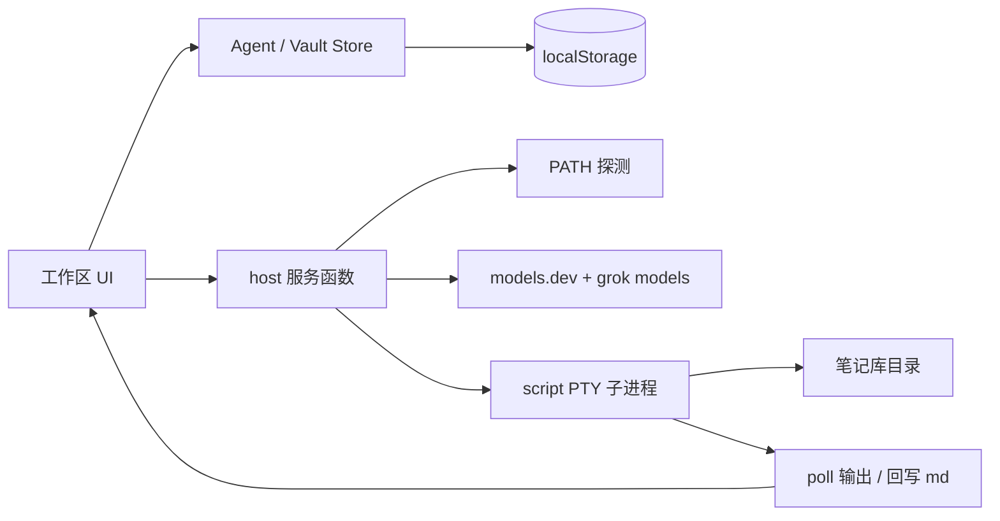

# Mooring 设计文档

笔记窗口 + 宿主机 Agent。左边写笔记，右边跑本机已经安装的 CLI 智能体。智能体的工作目录就是当前笔记库。

本文描述产品行为、界面约定和实现边界。不讨论外部产品对照。

---

## 1. 产品目标

- 在一个窗口里同时处理笔记和 Agent。
- Agent 不走云端编排，直接启动宿主机上的 CLI。
- 只有本机探测到的智能体才能新建；未安装的只出现在设置里，供查看和安装。
- 对话视图覆盖在伪终端之上：用户用聊天输入，底层仍是该 CLI 的 TUI / REPL。
- 模型、思考深度、权限档来自公开模型库 + 本机 CLI 列出的真实可选项，不手写过时名单。

### 非目标

- 不做多 Agent 编排、任务图、远程沙箱。
- 不做自定义 CLI 入口（新建菜单里没有「自定义命令」）。
- 不做账号系统；会话状态存在浏览器本地。
- 不把未安装的运行时伪装成可启动。

---

## 2. 界面结构

桌面是三栏：

```
┌─────────────────────────────────────────────────────────┐
│ Mooring                                                 │
├──────────┬──────────────────────────┬───────────────────┤
│ 文件树   │ 笔记编辑                 │ 会话标签  [对话|终端] [+] │
│          │                          │                   │
│ 笔记库   │ Markdown                 │ 对话 / 终端主体    │
│          │                          │ 输入栏             │
└──────────┴──────────────────────────┴───────────────────┘
```

窄屏切成三个底栏页：文件 / 笔记 / Agents。

### 右侧 Agents

| 区域 | 行为 |
| --- | --- |
| 顶栏左侧 | 会话标签（状态点、图标、名称、关闭）；没有会话时显示 `Agents` |
| 顶栏右侧 | 有活动会话时显示对话/终端滑动胶囊，再右侧是纯图标「新建」 |
| 新建菜单 | 搜索 + 本机已启用智能体列表 + 置顶「新终端」+ 底栏「智能体设置」 |
| 主体 | 对话与输入栏同一栏宽；用户消息靠右气泡，助手靠左纯文本。终端视图同样挂载，用 CSS 显隐 |

没有活动会话时隐藏对话/终端切换。空状态引导用户点新建，或先到设置里刷新并启用。

---

## 3. 核心概念

| 概念 | 说明 |
| --- | --- |
| 笔记库 | 一组 Markdown 文件，存在本地；Agent 的 cwd 指向这份库 |
| 智能体目录 | 内置 TUI/REPL 运行时清单，含探测命令、启动命令、yolo 参数 |
| 探测 | 只看 PATH / 常见安装目录里有没有可执行文件，不 spawn `which` |
| 启用 | 探测成功后，用户可在设置里关掉某个智能体，关掉的不进新建菜单 |
| 默认智能体 | 新建按钮（空状态）启动这一项；`auto` 按内置优先级挑第一个可用的 |
| 权限模式 | 全局：`yolo`（默认）或 `manual`。yolo 把各 CLI 的跳过确认参数拼进启动命令 |
| 默认视图 | 新会话打开对话还是终端 |
| 会话 | 一次 CLI 进程 + 对话记录 + 当前模型/思考/权限芯片。标签名用智能体名（Grok、Claude、终端）；同名会话加序号 |

---

## 4. 智能体目录

内置运行时（节选，完整列表见 `src/lib/agents/catalog.ts`）：

Claude、OpenClaude、Codex、Grok、Copilot、OpenCode、Gemini、Aider、Goose、Cursor、Droid、Amp、Kimi、Qwen Code、Hermes 等。

每条记录固定字段：

```
id / name
detectCmd + detectCmdAliases + detectRequiredCommands
launchCmd
yoloArgs / yoloEnv
promptInjectionMode
```

探测规则：

1. 走 PATH 与常见安装目录（`~/.local/bin`、`~/.grok/bin`、Homebrew、nvm、cargo 等）。
2. 别名命中视作同一智能体。
3. `detectRequiredCommands` 必须全部存在。
4. 当前运行时若在 `detectUnsupportedRuntimes` 里，记为不可用。
5. 探测只在「智能体设置」打开时跑，结果缓存到 `detectedAgentIds`。新建菜单**不探测**，只渲染「已探测且未禁用」的项。

新建菜单能出现的条件：用户在设置里刷新过，并且该智能体保持启用。

---

## 5. 启动命令与权限

全局权限在设置里用滑动胶囊切换：

- **Yolo**：拼上该 CLI 自己的绕过参数（例如 Grok `--permission-mode bypassPermissions`，Claude `--dangerously-skip-permissions`）。
- **普通**：只跑 `launchCmd`，让 CLI 自己弹确认。

命令展示用未加壳引号的一行，和真实 argv 一致。初始 prompt 按 `promptInjectionMode` 注入：argv、`--prompt`、stdin 等。

「新终端」不是目录里的智能体，固定用宿主机 `$SHELL`，强制终端视图。

---

## 6. 对话视图

对话不是另一套协议，是盖在 PTY 上的适配层。

每个智能体有一份 `AgentChatProfile`：

| 字段 | 作用 |
| --- | --- |
| `surface` | `tui` 或 `repl` |
| `followup` | `paste-cr` / `plain-cr` / `plain-lf` |
| `readyPatterns` | 屏幕出现这些字才允许发送 |
| `chromePatterns` | 从 transcript 里丢掉的 TUI 边框、快捷键提示 |
| `clearComposer` / `submitDelayMs` / `submitCount` | 跟进输入怎么清行、怎么回车 |

TUI 类（Grok、Claude、Codex…）用 bracketed paste + CR，并等就绪门。REPL 类（Aider、Goose…）用普通换行。屏幕差分只吸收助手新行，避免把用户回显和 chrome 写进气泡。

对话/终端切换：胶囊滑动（选中项有圆形底）。两个视图始终挂载。

---

## 7. 输入栏

胶囊卡片，结构从左到右、可折行：

```
[附件预览条]

发消息、粘贴截图，或把文件拖进来

[+]  [完全权限 ▾]              [Grok 4.6 High ▾]  [○]  [发送]
```

- `+`：28px 圆钮，指令 / 引用笔记 / 附加文件。
- 权限芯片：完全权限 / 工作区写入 / 只读。
- 模型芯片：当前模型 + 思考档合成文案，点开先选模型再选档位。
- 思考圆环：无文字，单独改档位。
- 发送：34px，`#679EFE`。无文字、仅附件也可发送。

`/` 弹出指令，选中后写进输入框；`@` 弹出笔记，选中后变成输入框上方的引用芯片。输入框本身尺寸不变。选中项的底色和强调色不同，避免两类补全看起来一样。

模型切换、思考档写入会话，并尽量通过该 CLI 的斜杠命令送到进程（`/model`、`/effort`）。CLI 不认的命令则只改本地状态。

### 多模态

输入栏本身是多模态入口，不依赖具体 CLI 的剪贴板协议。

| 入口 | 行为 |
| --- | --- |
| 粘贴 | 剪贴板里的图片 / 文件变成附件芯片（截图、复制的图片都走这条） |
| 拖放 | 拖到输入卡片上出现投放层，松手即附加 |
| 附加文件 | `+` 菜单，可多选图片与常见文本/PDF |
| 芯片 | 图片缩略图 + 文件名；点 × 移除。最多 8 个，单个 12MB |

发送时：

1. 文件写到工作区 `attachments/`，智能体 cwd 能直接读。
2. 用户气泡里显示缩略图或文件名。
3. 发给 CLI 的文本带上工作区路径列表。原生 TUI 不吃浏览器像素，路径是跨 CLI 最稳的方式。

刷新后预览图不落盘（避免撑爆本地存储），路径和文件名仍在。

---

## 8. 模型与思考深度

不维护手写过时名单。解析分两层，和常见编码 Agent 客户端同一思路：

1. **能力表**  
   拉取公开模型库 [models.dev](https://models.dev)（`/api.json`），按提供方取出 `reasoning` / `reasoning_options`。  
   离线时用内置快照 `src/lib/agents/models-dev-snapshot.ts`。缓存一天。

2. **可用性**  
   本机若有对应 CLI，再跑它自己的列表命令。Grok 用 `grok models`（优先 `--json`，否则解析纯文本）。  
   主机列表非空时，**以主机为准**，再用能力表补思考档。  
   主机拿不到时，Grok 回落到 CLI 内置默认：`grok-4.6`、`grok-4.5`。

过滤规则：丢掉 Imagine / 图像 / 视频路由。思考档按模型走，例如：

| 模型 | 档位 |
| --- | --- |
| Grok 4.6 | Low / Medium / High / Xhigh |
| Grok 4.5 | Low / Medium / High（没有 Xhigh） |
| Claude Opus 5 / Sonnet 5 / Fable 5.1 | Low … Max |
| GPT-5.5 / 5.4 | none … xhigh |

打开对话栏或刷新智能体设置时更新这份表。

---

## 9. 设置

设置是唯一做探测的地方。列表分两段：

- **已安装**：探测成功。可启用/禁用、设为默认、外链、展开看启动命令。
- **可安装**：未在 PATH 上。禁用新建，保留安装说明。

其它控件：

- 权限模式（Yolo / 普通）
- 默认视图（对话 / 终端）
- 默认智能体
- 刷新探测

新建菜单不包含这些；菜单只负责立刻启动。

---

## 10. 数据流



1. 用户点新建 → 用缓存的 `detectedAgentIds` 决定菜单。
2. `launchHostAgent` 把当前笔记库写到工作目录，再 `script` 包一层伪终端拉起 CLI。
3. `pollHostAgent` 抽 stdout，对话层做就绪门和屏幕差分。
4. 发送：清行（如需要）→ paste/明文 → 延迟回车。
5. 子进程改过的 `.md` 合并回笔记库。

---

## 11. 持久化

Zustand persist，键名 `mooring-agents-v7`。

保存：会话列表（运行中的会写成已退出）、活动会话、默认智能体、权限模式、默认视图、已探测 id、已禁用 id、模型目录。

不保存：PTY 句柄、实时屏幕缓冲。刷新页面后进程不在，需要重新新建。

笔记库另存一份 vault store，种子文件在 `vault/`。

---

## 12. 代码地图

| 路径 | 职责 |
| --- | --- |
| `src/components/workspace/Workspace.tsx` | 三栏布局 |
| `src/components/workspace/AgentDock.tsx` | 右侧坞、顶栏切换、会话页 |
| `src/components/workspace/NewAgentMenu.tsx` | 新建弹出菜单 |
| `src/components/workspace/AgentSettingsDialog.tsx` | 探测、启用、默认、权限 |
| `src/components/workspace/AgentChat.tsx` | 对话层 |
| `src/components/workspace/ComposerBar.tsx` | 输入栏 |
| `src/components/workspace/AgentTerminal.tsx` | xterm.js |
| `src/lib/agents/catalog.ts` | 目录、启动命令、yolo |
| `src/lib/agents/detect-catalog.ts` | PATH 探测纯函数 |
| `src/lib/agents/host.ts` | 探测 / 启动 / 读写 PTY / 拉模型 |
| `src/lib/agents/models-catalog.ts` | models.dev 映射、`grok models` 解析 |
| `src/lib/agents/chat-profile.ts` | 每智能体对话适配 |
| `src/lib/agents/store.ts` | 会话与偏好 |
| `src/lib/vault/store.ts` | 笔记库 |

---

## 13. 约束与验收

- 文案、注释、标识符不引用其它桌面 Agent 产品名。
- 新建菜单不出现未探测或已禁用的智能体。
- 顶栏「新建」和对话/终端切换都是纯图标。
- 默认启动模式以设置为准，出厂为 Yolo。
- Grok 模型列表不得出现不存在的「Grok 4」「Grok Code」这类手写项。
- 对话与终端切换不得卸载 PTY。
- Chat UI 只在该智能体配置了对话档案、且默认视图允许时作为首屏；纯终端启动项始终进终端。
